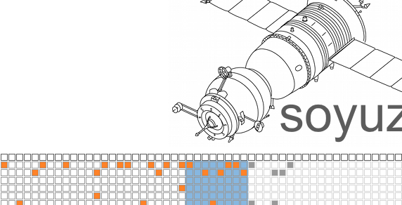

# soyuz

scrolling midi step sequencer

**created by:** stephen ball

soyuz is a scrolling midi step sequencer. sequence length is adjustable between 1 and 64 steps. keyboard arrow keys are used to scroll left, right, up and down across the interface. the sequencer has settings for note, velocity and duration, and can sync to an external midi clock. notes are input to the grid using rows 1-7 of the monome - the top row controls the position of the playhead, a la mlr. the "about" file in the download contains detailed information on getting started.